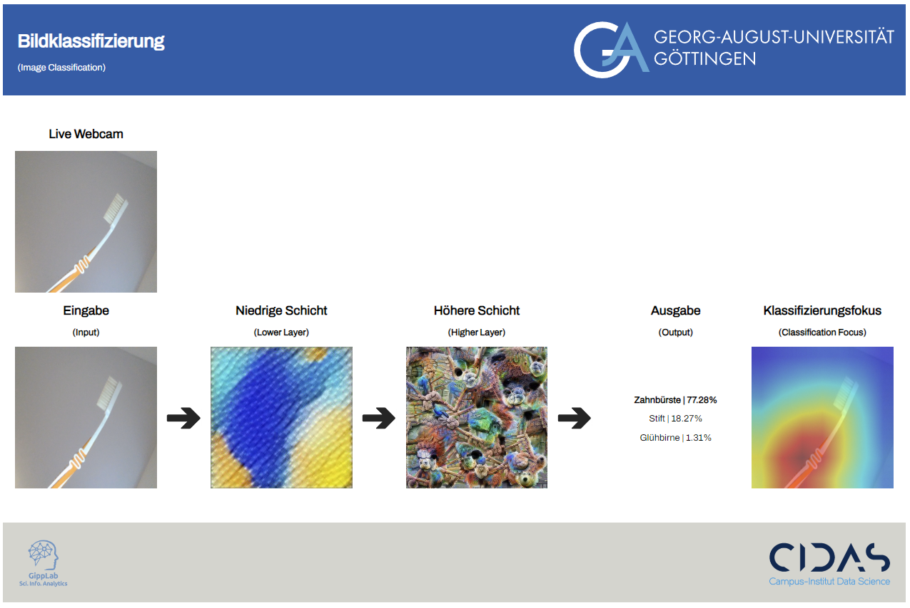

# CIDAS exhibition project
This project was developed for the [CIDAS exhibition](https://www.uni-goettingen.de/en/679751.html) on the 7th and 8th of November 2023 in Göttingen (Germany). 
The topic of the exhibition was “KI & Data Science entdecken” (Discover AI and Data Science). The project visualizes how a neural network classifies images.



The interface consists of the following parts:
- Live webcam: Video stream of the webcam
- Input camera image: Every 5 seconds, a snapshot from the webcam is taken and processed by the neural network
- Intermediate Layers: This part shows representations of the filters which were activated the most by the input image. The representations show what an image would look like that would lead to a maximal activation of the specific filter
  - Looking at the representations of the higher layers, it is possible to find similarities between them and the input image
  - For example, considering an image of a horse, the most activated filter could contain legs. Thus, it would explain why this filter was activated strongly by the input image and probably had a big influence on the final classification of the neural network
- Output: The top three predictions for the input image
- Classification focus: Class Activation Mapping (CAM) highlights on which part of the image the network was focused the most for its prediction

**Technical Description**
- Classes: There are 15 classes (see Data/labels_de.txt). The focus was put on objects that people would normally carry around while being at an exhibition and was extended by objects provided from us
- Model: We adapted the model Inception V1 which originally classified all 1000 classes from ImageNet. We replaced the last layer to classify only our 15 classes of interest
- Data: With our objects at hand, we generated our own data to train the last layer. We used 90 samples for training and 10 for evaluation. They can be found in the data folder. We also used images from ImageNet to retrain the last layer, so that the model generalizes better

**Prerequisites**
- A webcam
- Python installed (3.8-3.11) 

**Installation**
1. Clone the project
   ```
   git clone https://github.com/Plug2100/Visualization_for_the_exhibition.git
   ```
2. Create a new python environment
   1. Install pytorch for gpu (2.0.1) 
      - Windows/Linux: 
        ```
        pip install torch==2.0.1 torchvision==0.15.2 torchaudio==2.0.2 --index-url https://download.pytorch.org/whl/cu118
        ```
      - OSX:
        ```
        pip install torch==2.0.1 torchvision==0.15.2 torchaudio==2.0.2
        ```
      - See also https://pytorch.org/get-started/previous-versions/
   2. Install lucent
      ```
      pip install torch-lucent
      ```
   3. Install flask
      ```
      pip install flask
      ```
3. Run current version 
   ```
   python Visualization_Torch.py
   ```

**Our setup at the exhibition**
- Webcam: An external webcam which is directed on a white background to reduce any visual interferences 
- Screen: The prototype will be shown on a SMART board (a digital whiteboard) with the size 65" or 84"
- Objects: Some objects will be provided by us, but visitors are also allowed to place other objects before the camera
